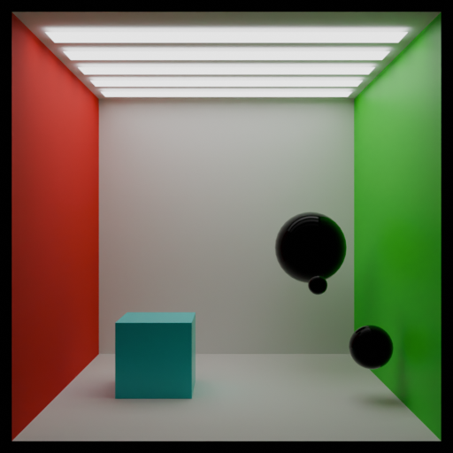
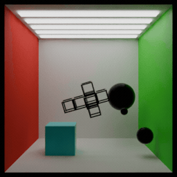
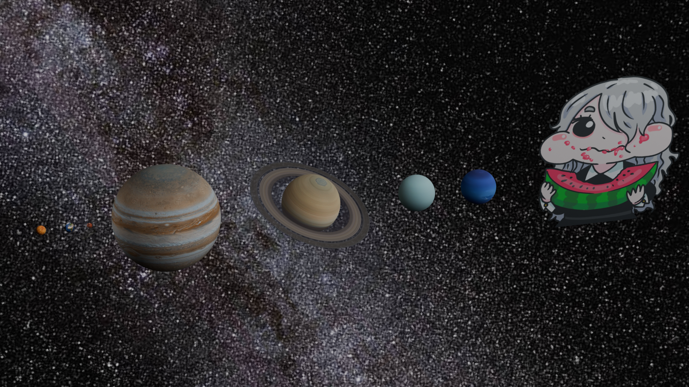

Just a repo to keep track of my work with Blender

# Blender Scientific Visualization Learning Path

## 1. Quick Cornell Box Viz

- [x] Basic cornell box setup w/ Cornell
- [x] Render via CLI
- [x] Render via Python script

Misc. notes:
- Workspaces at the top of the screen are different collections of editors. The icon+dropdown at the top left of each panel are the editor types.
- Usual keyboard operations: s for scale, g for translate, r for rotate. shift+a to add object (make sure you choose right; object mode vs editor mode).
- 1, 2, 3 to switch between vertex / face select while in edit mode.
- HDRs can be added in Properties Editor -> World -> Surface -> Color. 
- Output directory is in prop editor -> output prop -> output
- Version of blender installed through apt wouldn't work with Cycles, but extracting the tar.gz from blender did work. 

## 2. Animate the Cornell box + rotating object
- [x] Create a parented hierarchy (?) of objects
- [x] Experiment with booleans
- [x] Create an animation of the rotating objects
- [x] CLI render low quality .gif
- [x] CLI render high quality .mp4

Misc. notes:
- For rendering a low quality animation, it's better if the .blend is configured to render the high quality animation. From there you can scale down the screen size (using `-P script.py`) or skip an integer number of frames to get the downsampled image.

## 3. Create a "planets size comparison" render
- [x] Planet textures + layout + shaders

- [x] Video + animation render
- [ ] Overlay text onto video
- [ ] Any need to worry about f-curves and animation nodes?
- Understand terminology like timeline, dope sheet, f-curves, animation nodes

## 4. Import + render some mathematical objects from Mathematica
- Implicit surfaces
- Hydrogen wavefunction volume render?

## 5. Physics and Blender's Simulation Tools
- [ ] Water simulation: Dam break + transparent materials 
- [ ] Caltrops + funnel simulation

notes: 
- If possible, tie in some aspect of node based materials (Pool tiles?)
- "Learn basic simulation caching for complex scenes" (?)

## 6. Programming: Sound visualizer
- Project that used geometry nodes
- Project using Python

## 7. Programming: complex logistic map

## 8. Programming: double pendulum
